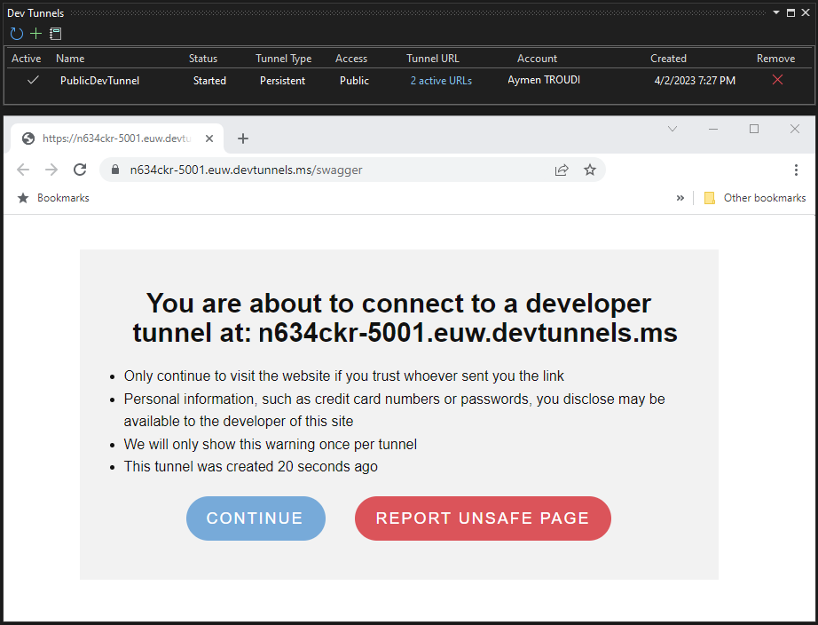

[](https://github.com/aimenux/DevTunnelsDemo/actions/workflows/ci.yml)

# DevTunnelsDemo
```
Experimenting dev tunnels
```

> In this repo, i m experimenting [dev tunnels](https://devblogs.microsoft.com/visualstudio/public-preview-of-dev-tunnels-in-visual-studio-for-asp-net-core-projects/?WT.mc_id=DT-MVP-5002040) feature in visual studio 2022.
>
>
> :bulb: Actually, only visual studio 2022 is supporting dev tunnels feature.
>
> 
>

**`Tools`** : vs22, net 6.0, web api, dev-tunnels, xunit, integration-testing